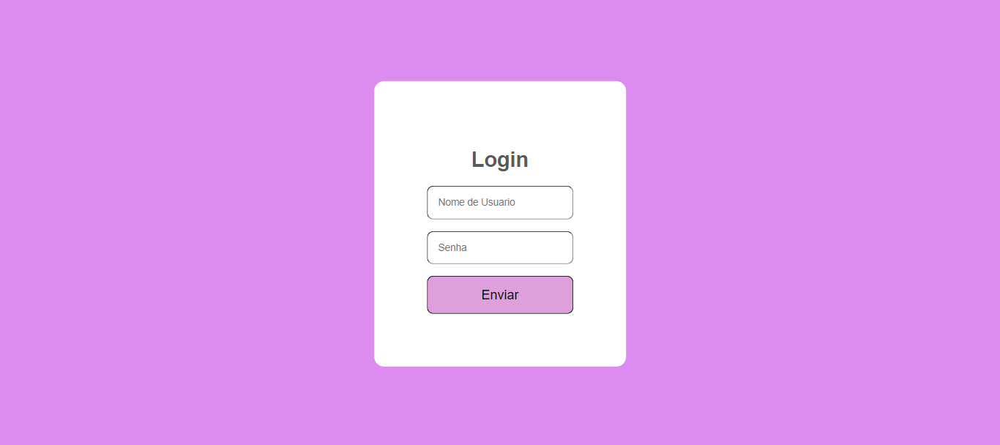

# Tela de login

## Sobre o projeto 
Página de login que apesar de simples, é ótima para praticar formulários no html, estilizaçao em CSS e interatividade utilizando javascript.

## Tecnologias utilizadas

- HTML
- CSS
-JAVASCRIPT

## Versionamento de código 
- Git

## Serviços utilizados 
- GitHub

## Como funciona:

Pagina de login com campos de preenchimento para nome, senha e botao de enviar. Quando o usuario clica em enviar, aparece na tela o alerta 'entrou!'.

